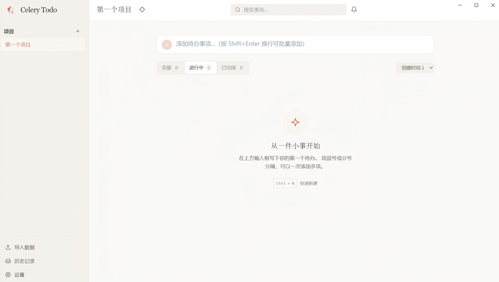

# 🥬 Celery Todo

> 一款功能完整的桌面端待办事项应用，Celery 风格 UI，支持多项目、归档历史、拖拽排序、专注模式与本地离线存储。

Celery Todo 是一个基于 Electron + React 的桌面 Todo 应用，所有数据通过 SQLite (WASM) 存储在本地，无需联网、无需账号，开箱即用。



[📚 开发文档](#-开发文档) · [🚀 快速开始](#-快速开始)

---

## ✨ 功能特性

### 待办管理

- **多项目管理** — 以项目维度组织待办，每个项目独立维护自己的事项列表
- **优先级与截止日期** — 高 / 中 / 低三档优先级，支持设置截止日期与到期提醒
- **Markdown 描述** — 事项描述支持 Markdown 语法渲染
- **拖拽排序** — 基于 `@dnd-kit` 的流畅拖拽体验，限定竖直方向、支持手动排序
- **筛选与排序** — 按全部 / 进行中 / 已完成筛选，按创建时间、截止日期、优先级或手动排序
- **批量操作** — 多选后批量完成 / 取消完成 / 归档 / 设置优先级

### 数据与系统

- **归档与历史记录** — 删除的事项进入归档，可在「设置 → 历史记录」中查看与恢复（30 天保留）
- **数据导入/导出** — 支持单项目或全量数据导出，方便备份与迁移
- **自动更新** — 应用启动时检查 GitHub Release 新版本，一键下载安装
- **桌面集成（Electron）** — 系统托盘、最小化到托盘、开机自启、桌面通知

### 界面与体验

- **专注模式** — 隐藏侧边栏与工具栏，只保留当前项目列表，沉浸式处理待办
- **主题切换** — 浅色 / 深色 / 跟随系统
- **键盘快捷键** — 常用操作均提供快捷键支持（详见[键盘快捷键](#️-键盘快捷键)）
- **统计面板** — 可视化展示完成情况与进度

## 🛠️ 技术栈

| 类别 | 技术 |
| --- | --- |
| 桌面框架 | Electron 31 |
| 前端框架 | React 18 + TypeScript 5 |
| 构建工具 | Vite 5 |
| 样式 | Tailwind CSS 3 |
| 状态管理 | Zustand |
| 本地存储 | sql.js (SQLite WASM) + IndexedDB |
| 拖拽 | @dnd-kit |
| 动画 | Framer Motion |
| 单元测试 | Vitest + Testing Library |
| E2E 测试 | Playwright (Electron) |
| 包管理 | Bun |

---

## 🚀 快速开始

### 环境要求

- [Node.js](https://nodejs.org/) ≥ 18
- [Bun](https://bun.sh/) ≥ 1.0（项目指定的包管理器）

### 安装依赖

```bash
bun install
```

### 开发模式

```bash
# 仅 Web 端（浏览器开发调试）
bun dev

# Electron 桌面端开发（构建 TS + 启动 Vite + 拉起 Electron）
bun run electron:dev
```

### 构建

```bash
# 构建 Web 产物
bun run build

# 构建 Web + Electron TypeScript
bun run build:electron

# 打包成可执行安装包（Windows NSIS）
bun run electron:build
```

打包产物位于 `release/` 目录下。

---

## 📜 常用脚本

| 命令 | 说明 |
| --- | --- |
| `bun dev` | 启动 Vite 开发服务器（仅 Web） |
| `bun run electron:dev` | 启动 Electron 桌面端开发模式 |
| `bun run build` | 构建前端产物（含 `tsc -b` 类型检查） |
| `bun run electron:build` | 打包桌面端安装包 |
| `bun test` | Vitest 监听模式运行单元测试 |
| `bun run test:run` | 单次运行单元测试 |
| `bun run test:coverage` | 运行测试并生成覆盖率报告 |
| `bun run lint` | ESLint 代码检查（`--max-warnings 0`） |
| `bun run format` | Prettier 格式化代码 |
| `bun run bump` | 发版：递增版本 + 写 CHANGELOG + 打 tag |
| `bun run cli` | 直接运行 CLI（tsx 免编译，例 `bun run cli list`） |
| `bun run build:cli` | 编译 CLI 到 `dist-cli/`（CommonJS） |
| `bun run test:cli` | 运行 CLI 测试（独立 vitest，临时 DB） |

E2E 测试脚本见 [测试策略](#-测试策略)。

> 💡 命令行工具 `celery` 可在终端直接管理待办（先定位桌面应用数据库）。详见 [`cli/README.md`](./cli/README.md)。

---

## ⌨️ 键盘快捷键

| 快捷键 | 功能 |
| --- | --- |
| `Ctrl/Cmd + N` | 新建事项（聚焦输入框） |
| `Ctrl/Cmd + S` | 手动保存（强制写入 IndexedDB） |
| `Ctrl/Cmd + F` | 聚焦搜索框 |
| `Ctrl/Cmd + /` | 显示快捷键帮助 |
| `Ctrl/Cmd + 1/2/3` | 切换筛选视图（全部 / 进行中 / 已完成） |
| `Ctrl/Cmd + B` | 切换侧边栏 |
| `Ctrl/Cmd + D` | 切换深色 / 浅色主题 |
| `Ctrl/Cmd + P` | 切换专注模式 |
| `Esc` | 取消编辑 / 关闭对话框 |

---

## 🏗️ 项目架构

```
celery-todo/
├── electron/               # Electron 主进程
│   ├── main.ts             # 窗口管理、自启动、单实例锁
│   ├── preload.ts          # IPC 桥接
│   ├── tray.ts             # 系统托盘
│   ├── updater.ts          # electron-updater 自动更新
│   ├── storage.ts          # 文件系统辅助
│   ├── types.ts            # 主进程类型
│   └── tsconfig.json       # Electron 独立 TS 配置（CJS 输出）
├── src/
│   ├── components/         # React 组件，按域分组
│   │   ├── common/         # 通用组件（对话框、图标、通知等）
│   │   ├── filters/        # 筛选与搜索
│   │   ├── layout/         # 布局（Header）
│   │   ├── projects/       # 项目侧边栏
│   │   ├── settings/       # 设置面板、历史记录、归档视图
│   │   ├── stats/          # 统计面板
│   │   └── todos/          # 待办事项相关组件
│   ├── hooks/              # 自定义 Hooks（含键盘快捷键、自动更新）
│   ├── store/              # Zustand 状态管理
│   ├── utils/              # 工具函数（数据库、导出、辅助函数）
│   ├── types/              # 共享 TypeScript 类型
│   ├── styles/             # 全局样式
│   └── test/               # Vitest 单元/组件测试
├── e2e/                    # Playwright Electron E2E 测试
├── public/                 # 静态资源（含 sql-wasm.wasm）
├── scripts/                # 构建与发版辅助脚本
└── package.json
```

### 数据流

```
React 组件 → 自定义 Hooks → Zustand Store → SQLite (sql.js WASM)
                                                     ↓
                                                IndexedDB 持久化
```

- 数据层使用 sql.js 在浏览器/Electron 中运行 SQLite，数据库二进制通过 IndexedDB 持久化。
- 保存采用 500ms 防抖自动写入，并支持手动 `flushSave()`（`Ctrl/Cmd + S`）。
- 每个待办都归属某个 `project_id`；切换项目时调用 `useTodoStore.loadProject(id)`。
- 架构边界：**组件 → Hooks → Zustand stores → `src/utils/database.ts`**，不增加额外的抽象层。

---

## 🧪 测试策略

两层测试，严格隔离：

- **Vitest 单元/组件测试**（`src/test/`）— 运行在 jsdom，不依赖 Electron，速度快。
- **Playwright Electron E2E**（`e2e/`）— 通过 `_electron.launch()` 驱动真实打包的应用，每个测试使用独立的 `userData` 目录隔离。

常用 E2E 命令：

```bash
bunx playwright test e2e/todos.spec.ts          # 单个文件
bunx playwright test -g "拖拽"                    # 按名称关键词
bunx playwright test --last-failed              # 仅上次失败项
bunx playwright test e2e/todos.spec.ts --headed # 显式窗口运行
```

完整 E2E 套件每个测试都启动独立 Electron 进程并冷加载 sql-wasm.wasm，耗时较长，建议按改动域选跑相关 spec。详见 [`AGENTS.md`](./AGENTS.md) 的「Change-area → spec map」。

---

## 📚 开发文档

| 文档 | 内容 |
| --- | --- |
| [`AGENTS.md`](./AGENTS.md) | AI 协作工作区规范：命令、架构边界、E2E 约定 |
| [`VERSIONING.md`](./VERSIONING.md) | 三类版本号（App / DB schema / 导出格式）策略与发版流程 |
| [`CHANGELOG.md`](./CHANGELOG.md) | 版本变更日志（Keep a Changelog 格式） |
| [`CLAUDE.md`](./CLAUDE.md) | Claude Code 协作背景（中英双语） |

### 版本号速查

本项目同时维护三个相互独立的版本号（详见 [`VERSIONING.md`](./VERSIONING.md)）：

| 版本号 | 单一源 | 用途 |
| --- | --- | --- |
| **App 版本** | `package.json` `version` | 用户可见发行版本，打 git tag |
| **DB schema 版本** | `src/utils/database.ts` `DB_VERSION` | SQLite 表结构迁移门控 |
| **导出格式版本** | `src/utils/export.ts` `EXPORT_FORMAT_VERSION` | JSON 导入/导出文件兼容性标识 |

发版一条命令：

```bash
bun run bump -- <patch|minor|major> --push
```

---

## ⚠️ 已知平台行为

- **Windows 拖拽改窗口大小时右上角出现尺寸数字**：这是 Windows DWM 在无框窗口上绘制的原生尺寸提示，与 Electron 无框 + `titleBarOverlay` 配合时的已知现象（[electron/electron#943](https://github.com/electron/electron/issues/943)）。非 Bug，应用层无法移除，仅影响拖拽改大小期间的视觉。

---

## 🤝 贡献

欢迎提 Issue 与 PR：

- 仓库：<https://github.com/ouyangfeng2022/celery-todo>
- 问题反馈：<https://github.com/ouyangfeng2022/celery-todo/issues>
- 提交前请运行 `bun run lint` 与 `bun run test:run`，确保无 lint 警告、测试通过。
- Commit 信息遵循 [Conventional Commits](https://www.conventionalcommits.org/)，`bun run bump` 会据此自动归类到 CHANGELOG。

---

## 📄 许可证

本项目基于 [MIT License](./LICENSE) 开源。
