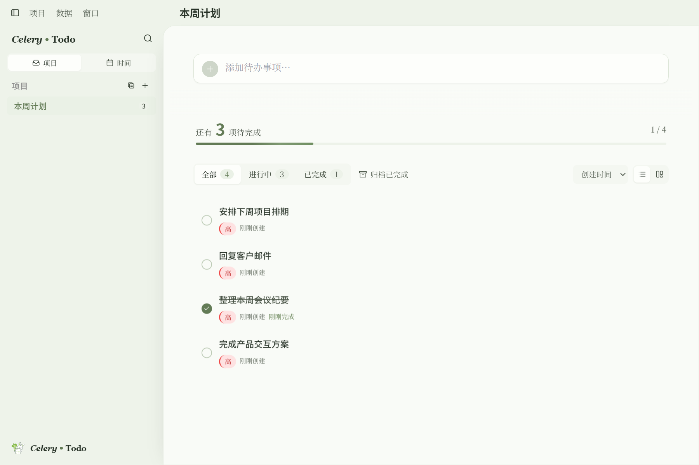
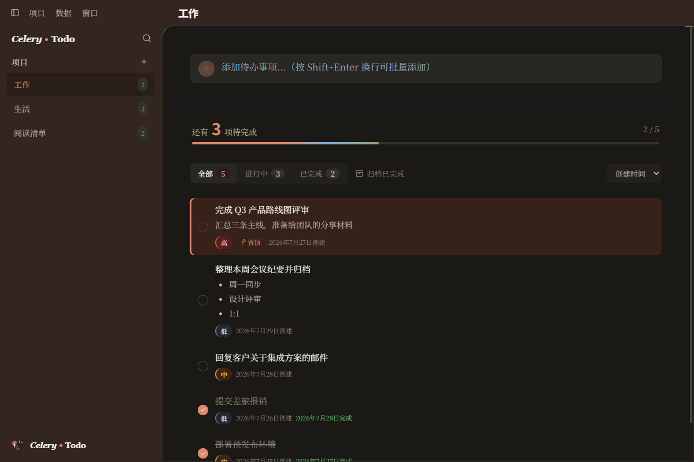
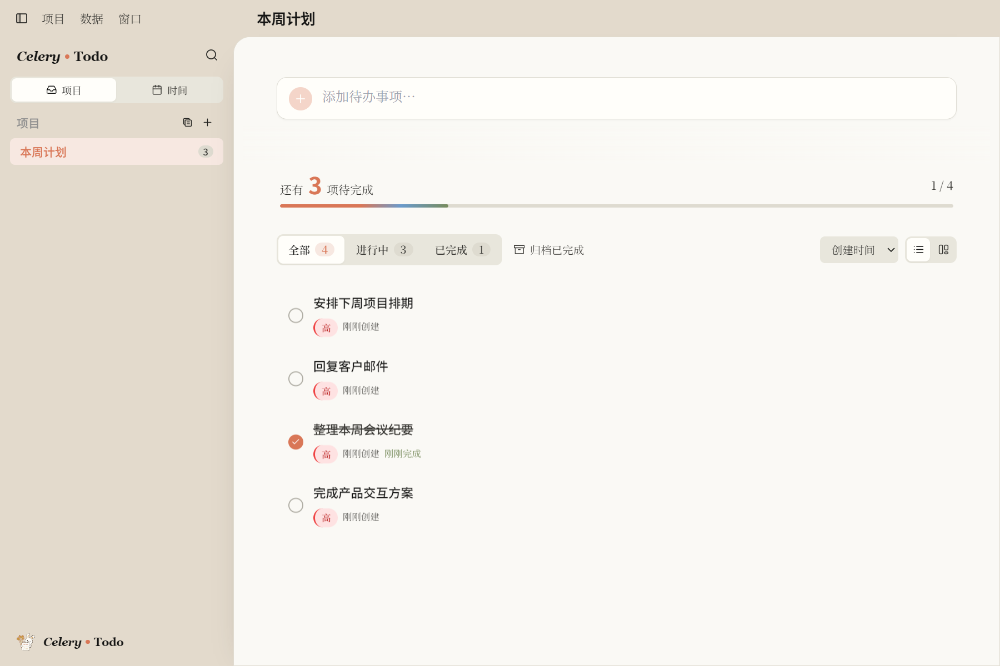
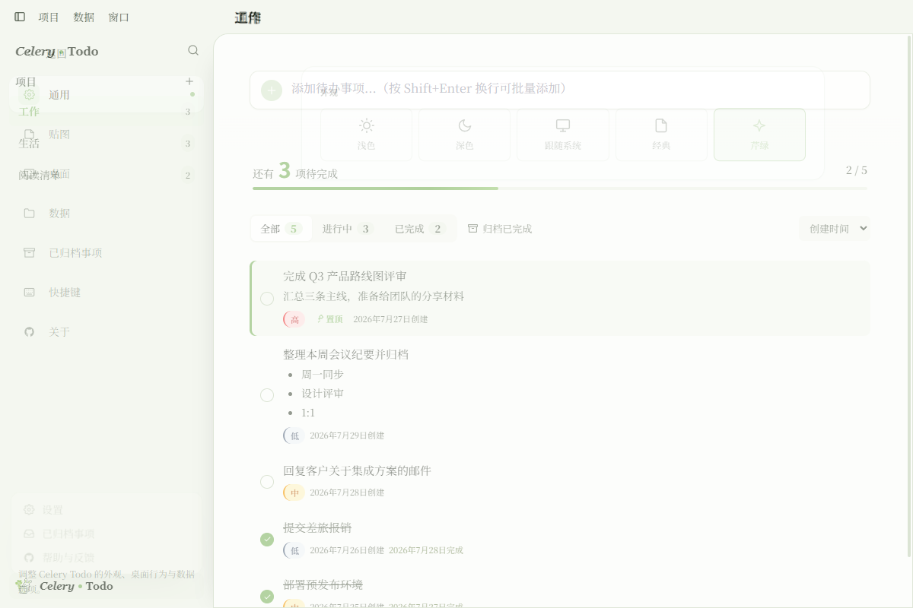
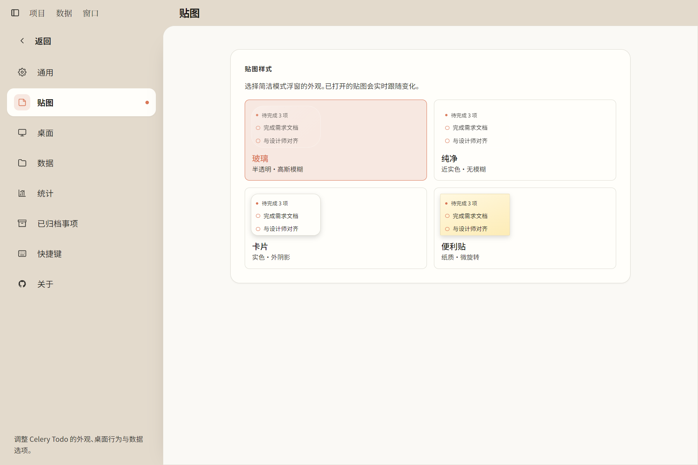
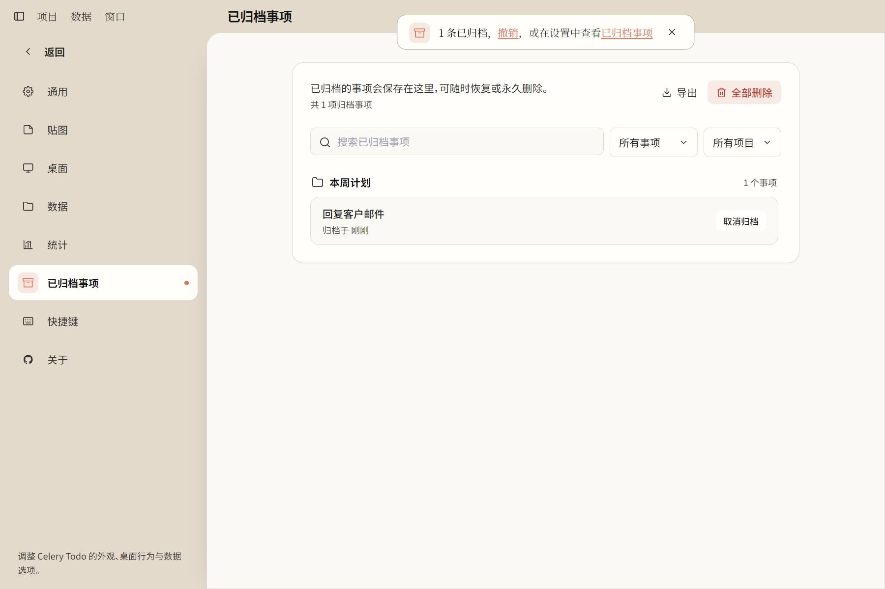
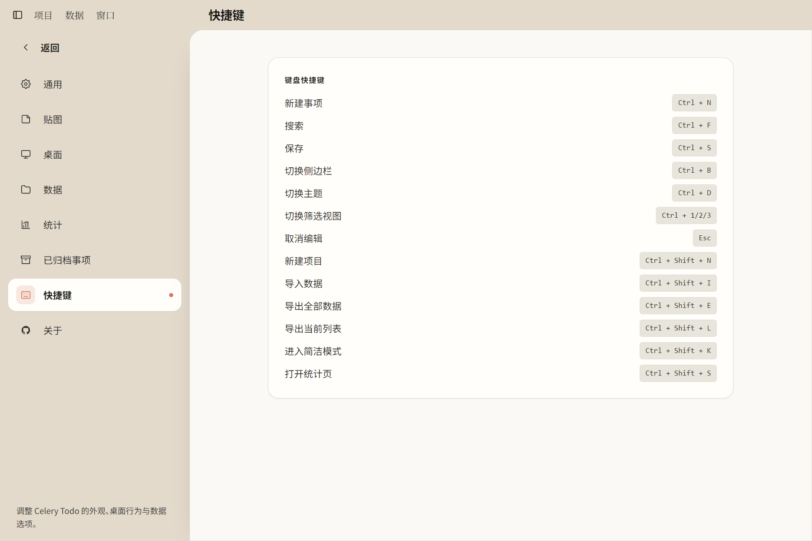

<div align="center">


# Celery Todo

**一款功能完整的桌面端待办事项应用**

Celery 风格 UI · 多项目管理 · 桌面贴图浮窗 · 置顶 · 拖拽排序 · 本地离线存储

<p>
  <a href="https://github.com/ouyangfeng2022/celery-todo/releases"></a>
  
  
  
  
  <a href="./LICENSE"></a>
  <a href="https://github.com/ouyangfeng2022/celery-todo/actions"></a>
  
</p>

<p>
  <a href="#-功能特性">功能</a> ·
  <a href="#-截图预览">截图</a> ·
  <a href="#-快速开始">快速开始</a> ·
  <a href="#-键盘快捷键">快捷键</a> ·
  <a href="#-项目架构">架构</a> ·
  <a href="#-开发文档">文档</a>
</p>

</div>

Celery Todo 是一个基于 Electron + React 的桌面 Todo 应用，所有数据通过 SQLite (WASM) 存储在本地，无需联网、无需账号，开箱即用。配套命令行工具 `celery` 可在终端直接管理同一份数据库。

---

## 📸 截图预览

<p align="center">
  
  <sub><b>主界面 · 芹绿主题</b>　——　多项目侧边栏、置顶、优先级、Markdown 描述、统计进度</sub>
</p>

<table>
  <tr>
    <td width="50%" align="center">
      <br/>
      <sub><b>深色主题</b></sub>
    </td>
    <td width="50%" align="center">
      <br/>
      <sub><b>经典 · 纸白主题</b></sub>
    </td>
  </tr>
  <tr>
    <td width="50%" align="center">
      <br/>
      <sub><b>设置 · 主题切换</b></sub>
    </td>
    <td width="50%" align="center">
      <br/>
      <sub><b>设置 · 桌面贴图样式</b></sub>
    </td>
  </tr>
  <tr>
    <td width="50%" align="center">
      <br/>
      <sub><b>已归档事项 · 搜索与恢复</b></sub>
    </td>
    <td width="50%" align="center">
      <br/>
      <sub><b>键盘快捷键一览</b></sub>
    </td>
  </tr>
</table>

---

## ✨ 功能特性

### 待办管理

- **多项目管理** — 以项目维度组织待办，侧边栏支持拖拽排序，启动时自动恢复上次激活的项目
- **优先级与置顶** — 高 / 中 / 低三档优先级，置顶项始终浮在列表最前并带背景色与左侧色条
- **Markdown 描述** — 事项描述支持 Markdown 语法渲染，外链走系统默认浏览器
- **拖拽排序** — 基于 `@dnd-kit` 的竖直拖拽，限定上下方向；切换其他排序方式时自动快照当前顺序转入手动模式
- **筛选与排序** — 按全部 / 进行中 / 已完成筛选，按创建时间或优先级排序；排序与筛选按项目独立持久化
- **批量操作** — 多选后批量完成 / 取消完成 / 归档 / 设置优先级

### 桌面贴图（简洁模式）

- **桌面浮窗贴纸** — 把任意项目「贴」到桌面，悬浮查看与一键勾选完成，复用主窗口的排序与优先级逻辑
- **可定制贴图风格** — 玻璃 / 纯净 / 卡片 / 便利贴 四种预设，或自定义圆角、模糊、不透明度、外阴影
- **托盘集成入口** — 系统托盘菜单可一键创建浮窗、显示所有浮窗、快速添加事项

### 数据与系统

- **归档与历史记录** — 删除的事项进入归档（不再自动清除），可在「设置 → 历史记录」中分页查看、恢复或永久删除（均带二次确认）
- **数据导入 / 导出** — 支持单项目或全量数据导出，方便备份与迁移
- **自动更新** — 启动时检查 GitHub Release 新版本，发现新版后弹窗提示，下载、进度、重启在同一弹窗内完成
- **自定义安装** — 安装向导可勾选开机自启与自定义数据目录，设置项由 NSIS 一次性写入、应用即删除

### 界面与体验

- **五种主题** — 浅色 / 深色 / 跟随系统 / 经典（纸白）/ 芹绿 一键切换
- **键盘快捷键** — 全局快捷键覆盖新建、保存、筛选、侧边栏、主题、导入导出、贴图浮窗等高频操作（详见[键盘快捷键](#%EF%B8%8F-键盘快捷键)）
- **统计面板** — 可视化展示完成情况与进度
- **全部完成庆祝** — 列表清空时撒花 + 庆祝卡片，支持一键归档当批已完成项

> **从 1.x 升级须知**：v2.0.0 移除了事项的截止日期与到期提醒功能（不可逆 schema 迁移），v2.4.0 移除了原「专注模式」，由桌面贴图浮窗承担。详见 [`CHANGELOG.md`](./CHANGELOG.md)。

---

## 🛠 技术栈

| 类别 | 技术 |
| --- | --- |
| 桌面框架 | Electron 31 |
| 前端框架 | React 18 + TypeScript 5 |
| 构建工具 | Vite 5 |
| 样式 | Tailwind CSS 3 |
| 状态管理 | Zustand |
| 本地存储 | sql.js (SQLite WASM) + IndexedDB / 文件 |
| 拖拽 | @dnd-kit |
| 动画 | Framer Motion |
| 单元测试 | Vitest + Testing Library |
| E2E 测试 | Playwright (Electron) |
| CLI | better-sqlite3 + commander（双模式：IPC / 直连） |
| 包管理 | Bun |

---

## 🚀 快速开始

### 环境要求

- [Node.js](https://nodejs.org/) ≥ 18
- [Bun](https://bun.sh/) ≥ 1.0（项目指定的包管理器）

### 安装依赖

```bash
bun install
```

### 开发模式

```bash
# 仅 Web 端（浏览器开发调试）
bun dev

# Electron 桌面端开发（构建 TS + 启动 Vite + 拉起 Electron）
bun run electron:dev
```

### 构建

```bash
# 构建 Web 产物（含 tsc -b 类型检查）
bun run build

# 构建 Web + Electron TypeScript
bun run build:electron

# 打包成可执行安装包（Windows NSIS）
bun run electron:build
```

打包产物位于 `release/` 目录下。

---

## 📜 常用脚本

| 命令 | 说明 |
| --- | --- |
| `bun dev` | 启动 Vite 开发服务器（仅 Web） |
| `bun run electron:dev` | 启动 Electron 桌面端开发模式 |
| `bun run build` | 构建前端产物（含 `tsc -b` 类型检查） |
| `bun run electron:build` | 打包桌面端安装包 |
| `bun test` | Vitest 监听模式运行单元测试 |
| `bun run test:run` | 单次运行单元测试 |
| `bun run test:coverage` | 运行测试并生成覆盖率报告 |
| `bun run lint` | ESLint 代码检查（`--max-warnings 0`） |
| `bun run format` | Prettier 格式化代码 |
| `bun run bump` | 发版：递增版本 + 写 CHANGELOG + 打 tag |
| `bun run cli` | 直接运行 CLI（tsx 免编译，例 `bun run cli list`） |
| `bun run build:cli` | 编译 CLI 到 `dist-cli/`（CommonJS） |
| `bun run test:cli` | 运行 CLI 测试（独立 vitest，临时 DB） |

E2E 测试命令见[测试策略](#-测试策略)。

> 💡 命令行工具 `celery` 可在终端直接管理待办（GUI 运行时走 IPC 实时同步，未运行时直连 SQLite 文件）。完整说明见 [`cli/README.md`](./cli/README.md)。

---

## ⌨️ 键盘快捷键

### 基础快捷键

| 快捷键 | 功能 |
| --- | --- |
| `Ctrl/Cmd + N` | 新建事项（聚焦输入框） |
| `Ctrl/Cmd + S` | 手动保存（强制写入持久化） |
| `Ctrl/Cmd + F` | 聚焦搜索框 |
| `Ctrl/Cmd + /` | 显示快捷键帮助 |
| `Ctrl/Cmd + 1/2/3` | 切换筛选视图（全部 / 进行中 / 已完成） |
| `Ctrl/Cmd + B` | 切换侧边栏 |
| `Ctrl/Cmd + D` | 切换深色 / 浅色主题 |
| `Esc` | 取消编辑 / 关闭对话框 |

### 项目 / 数据 / 窗口（`Ctrl/Cmd + Shift` 组合）

| 快捷键 | 功能 |
| --- | --- |
| `Ctrl/Cmd + Shift + N` | 新建项目 |
| `Ctrl/Cmd + Shift + I` | 导入数据 |
| `Ctrl/Cmd + Shift + E` | 导出全部数据 |
| `Ctrl/Cmd + Shift + L` | 导出当前列表 |
| `Ctrl/Cmd + Shift + K` | 进入简洁模式（桌面贴图浮窗） |

---

## 🏗 项目架构

```
celery-todo/
├── electron/               # Electron 主进程
│   ├── main.ts             # 窗口管理、自启动、单实例锁、IPC
│   ├── preload.ts          # IPC 桥接（含 CLI ↔ GUI 通道）
│   ├── tray.ts             # 系统托盘菜单
│   ├── updater.ts          # electron-updater 自动更新
│   ├── cli-server.ts       # CLI IPC 服务（JSON-RPC over net）
│   ├── install-options.ts  # NSIS 安装选项「一次性信箱」
│   ├── storage.ts          # 文件系统辅助
│   ├── types.ts            # 主进程类型
│   └── tsconfig.json       # Electron 独立 TS 配置（CJS 输出）
├── src/
│   ├── components/         # React 组件，按域分组
│   │   ├── common/         # 通用（对话框、图标、空状态、更新弹窗、庆祝）
│   │   ├── filters/        # 筛选栏与搜索栏
│   │   ├── layout/         # 顶部 Header
│   │   ├── projects/       # 项目侧边栏
│   │   ├── settings/       # 设置页（分子页面：通用/桌面/数据/历史/贴图/快捷键/关于）
│   │   ├── stats/          # 统计面板
│   │   ├── sticker/        # 桌面贴图浮窗
│   │   └── todos/          # 待办事项相关组件
│   ├── hooks/              # 自定义 Hooks（键盘快捷键、自动更新等）
│   ├── store/              # Zustand 状态管理（todo / project / settings）
│   ├── utils/              # database.ts / export.ts / helpers / version
│   ├── types/              # 共享 TypeScript 类型
│   ├── styles/             # 全局样式
│   └── test/               # Vitest 单元/组件测试
├── cli/                    # 独立 CLI（celery）：better-sqlite3 + commander
├── e2e/                    # Playwright Electron E2E 测试
├── public/                 # 静态资源（含 sql-wasm.wasm）
├── build/                  # NSIS 安装脚本（installer.nsh）
├── scripts/                # 构建与发版辅助脚本
└── package.json
```

### 数据流

```
React 组件 → 自定义 Hooks → Zustand Store → SQLite (sql.js WASM)
                                                     ↓
                          Electron IPC 文件持久化 / Web 端 IndexedDB 兜底
```

- 数据层使用 sql.js 在浏览器/Electron 中运行 SQLite；桌面端经 IPC 把数据库二进制写入真实文件，存储位置可在设置中自定义，Web 端兜底使用 IndexedDB。
- 保存采用 500ms 防抖自动写入，并支持手动 `flushSave()`（`Ctrl/Cmd + S`）。
- 每个待办都归属某个 `project_id`；切换项目时调用 `useTodoStore.loadProject(id)`。
- 架构边界：**组件 → Hooks → Zustand stores → `src/utils/database.ts`**，不增加额外的抽象层。

### CLI 与 GUI 的实时同步

`celery` 命令行工具采用双模式架构，对用户完全无感知：

- **IPC 模式**（GUI 运行时）：CLI 通过 Unix socket / Windows 命名管道把操作发往主进程，经渲染进程的 store action 走正常防抖保存路径，**改动立即反映在 GUI**。
- **直连模式**（GUI 未运行）：用 better-sqlite3 直接读写 SQLite 文件，下次启动 GUI 时加载。

详见 [`cli/README.md`](./cli/README.md)。

---

## 🗄 数据库结构

| 表 | 说明 |
| --- | --- |
| `projects` | `id, name, color, sort_order, created_at, updated_at` |
| `todos` | `id, project_id, title, description, completed, priority, sort_order, pinned, created_at, updated_at, completed_at` |
| `deleted_todos` | 同 `todos` + `deleted_at, expires_at`（归档；`expires_at` 已废弃，仅为兼容旧数据保留） |
| `settings` | `key, value`（K/V 存储，含主题、贴图样式、`dataVersion` 迁移水位线等） |

> Schema 当前为 `DB_VERSION = 4`（v2.0.0 已不可逆地移除 `due_date` 列）。任何 schema 改动必须 bump `DB_VERSION` 并在 `database.ts` 的 `MIGRATIONS` 表追加迁移条目。

---

## 🧪 测试策略

两层测试，严格隔离：

- **Vitest 单元/组件测试**（`src/test/`）— 运行在 jsdom，不依赖 Electron，速度快。
- **Playwright Electron E2E**（`e2e/`）— 通过 `_electron.launch()` 驱动真实打包的应用，每个测试使用独立的 `userData` 目录隔离。

常用 E2E 命令：

```bash
bunx playwright test e2e/todos.spec.ts          # 单个文件
bunx playwright test -g "拖拽"                    # 按名称关键词
bunx playwright test --last-failed              # 仅上次失败项
bunx playwright test e2e/todos.spec.ts --headed # 显式窗口运行
```

完整 E2E 套件每个测试都启动独立 Electron 进程并冷加载 sql-wasm.wasm，耗时较长，建议按改动域选跑相关 spec。CLI 与 Electron 无关，改动 `cli/**` 只需 `bun run test:cli`，无需跑 Playwright。详见 [`AGENTS.md`](./AGENTS.md) 的「Change-area → spec map」。

---

## 📚 开发文档

| 文档 | 内容 |
| --- | --- |
| [`AGENTS.md`](./AGENTS.md) | AI 协作工作区规范：命令、架构边界、E2E 约定 |
| [`VERSIONING.md`](./VERSIONING.md) | 三类版本号（App / DB schema / 导出格式）策略与发版流程 |
| [`CHANGELOG.md`](./CHANGELOG.md) | 版本变更日志（Keep a Changelog 格式） |
| [`cli/README.md`](./cli/README.md) | 命令行工具 `celery` 的命令、模式与架构 |

### 版本号速查

本项目同时维护三个相互独立的版本号（详见 [`VERSIONING.md`](./VERSIONING.md)）：

| 版本号 | 单一源 | 用途 |
| --- | --- | --- |
| **App 版本** | `package.json` `version` | 用户可见发行版本，打 git tag |
| **DB schema 版本** | `src/utils/database.ts` `DB_VERSION` | SQLite 表结构迁移门控（当前为 `4`） |
| **导出格式版本** | `src/utils/export.ts` `EXPORT_FORMAT_VERSION` | JSON 导入/导出文件兼容性标识 |

发版一条命令（递增版本 → 写 CHANGELOG → commit → 打 tag → 推送 → GitHub Actions 自动构建发版）：

```bash
bun run bump -- <patch|minor|major> --push
```

---

## ⚠️ 已知平台行为

- **Windows 拖拽改窗口大小时右上角出现尺寸数字**：这是 Windows DWM 在无框窗口上绘制的原生尺寸提示，与 Electron 无框 + `titleBarOverlay` 配合时的已知现象（[electron/electron#943](https://github.com/electron/electron/issues/943)）。非 Bug，应用层无法移除，仅影响拖拽改大小期间的视觉。

---

## 🤝 贡献

欢迎提 Issue 与 PR：

- 仓库：<https://github.com/ouyangfeng2022/celery-todo>
- 问题反馈：<https://github.com/ouyangfeng2022/celery-todo/issues>
- 提交前请运行 `bun run lint` 与 `bun run test:run`，确保无 lint 警告、测试通过。
- Commit 信息遵循 [Conventional Commits](https://www.conventionalcommits.org/)，`bun run bump` 会据此自动归类到 CHANGELOG。

---

## 📄 许可证

本项目基于 [MIT License](./LICENSE) 开源。
